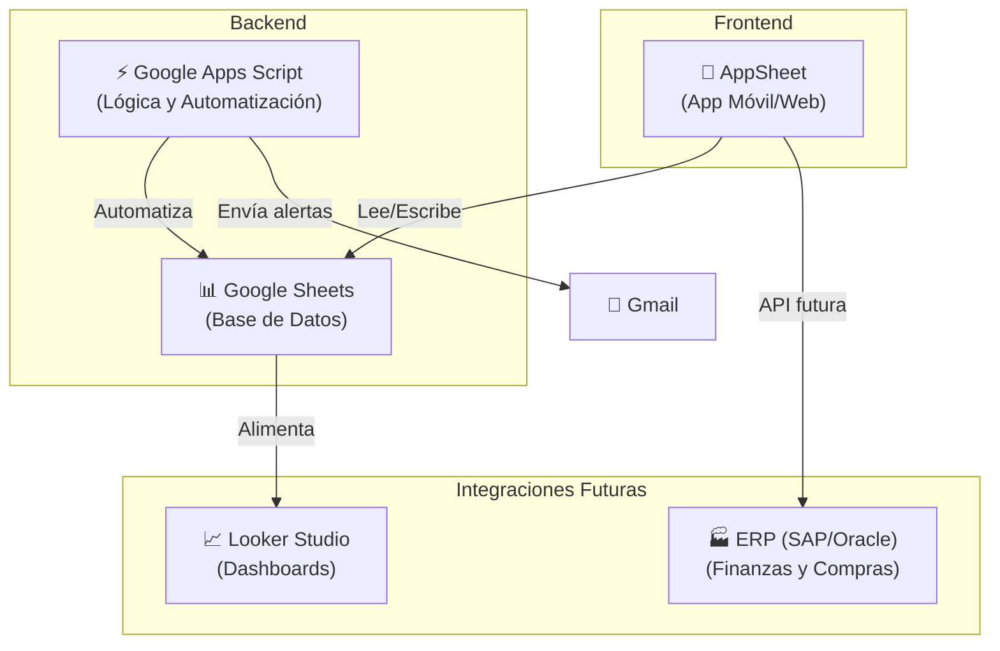
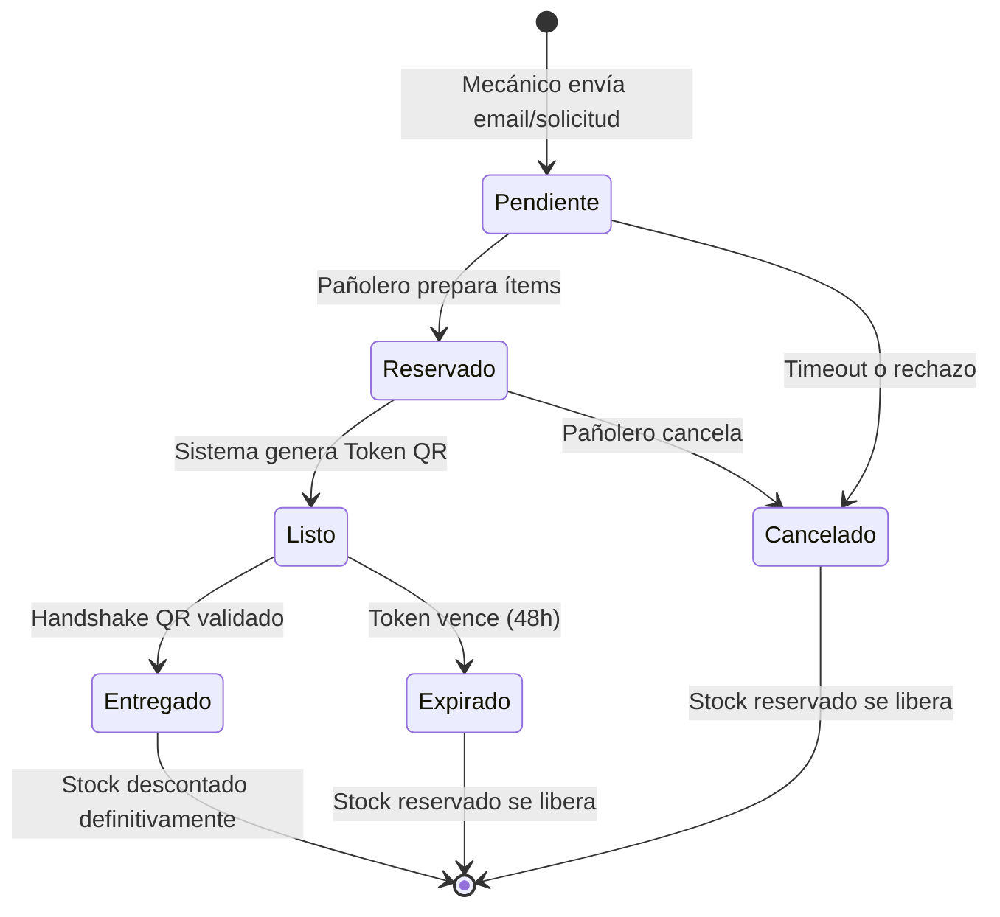
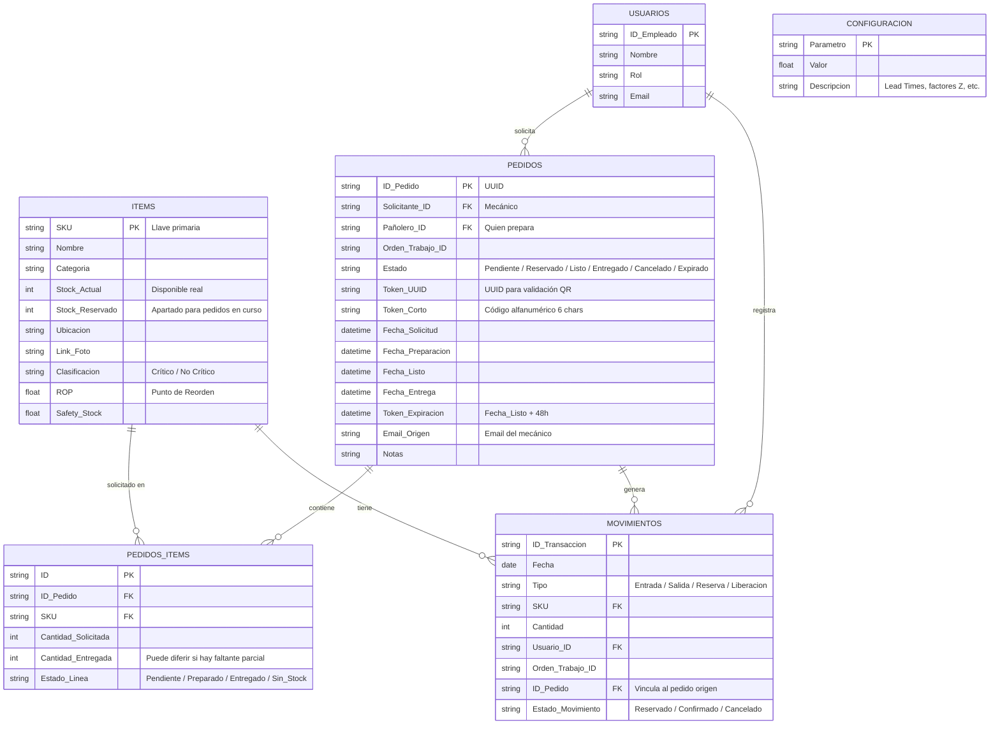
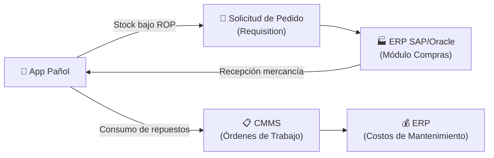
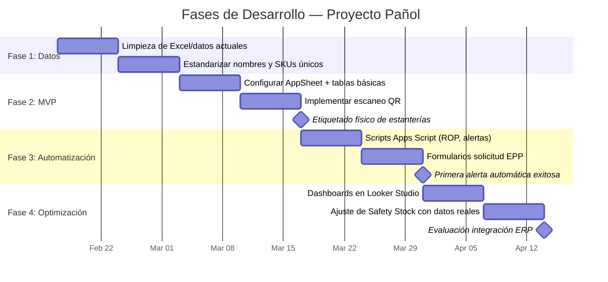
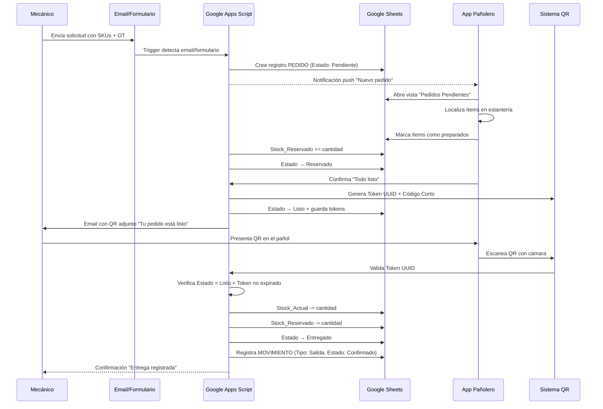

# 🔧 Proyecto Pañol — Resumen de Aplicación Completa

> **Fuente:** Cuaderno "Proyecto Pañol" de NotebookLM (58 fuentes analizadas)
> **Fecha:** 13 de febrero de 2026

---

## 1. Objetivo Principal

El objetivo central de la aplicación **"Pañol"** es **garantizar la disponibilidad operativa** de una planta industrial (contexto: vino y fruta fresca) mediante una gestión eficiente de repuestos críticos y consumibles.

### Problemas que resuelve:

| Problema | Solución |
|---|---|
| **Inventario Fantasma** | Registro en tiempo real de entradas/salidas para que sistema = físico |
| **Tiempo de Inactividad (Downtime)** | Evitar paradas de línea por falta de repuestos críticos |
| **Descontrol de Costos de EPP** | Monitoreo de consumo de EPP por técnico |
| **Procesos Manuales** | Automatización de reabastecimiento y alertas |

---

## 2. Arquitectura del Sistema

Se recomienda una arquitectura **Low-Code/No-Code** integrada con el ecosistema de Google:



### Tecnologías Recomendadas

| Componente | Tecnología | Justificación |
|---|---|---|
| **Frontend** | **AppSheet** (Google) | Integración nativa con Sheets, funciona offline, escaneo de códigos nativo |
| **Alternativa Frontend** | Power Apps (Microsoft) | Si la empresa usa Microsoft 365 |
| **Base de Datos** | **Google Sheets** (inicio) → **Cloud SQL / AppSheet Database** (escala) | Flexible, edición rápida. Migrar si >5,000 registros o alta concurrencia |
| **Automatización** | **Google Apps Script** | Cálculos avanzados, envío de correos HTML, integraciones API |
| **Dashboards** | **Looker Studio** | Conectado a Sheets para visualizar gastos y rotación |

---

## 3. Módulos y Funcionalidades

### 3.1 Maestro de Materiales (Catálogo)

- Base de datos centralizada con **SKU**, descripción, ubicación física (pasillo/estante)
- Fotos del repuesto
- Clasificación: **Crítico / No Crítico**

### 3.2 Gestión de Movimientos (Entradas/Salidas)

- **Check-In (Recepción):** Ingreso de stock escaneando guía de despacho, actualización automática de cantidades
- **Check-Out (Entrega):** Salida vinculada a una **Orden de Trabajo** o **Técnico**. Debe ser rápido (escaneo) para no entorpecer emergencias

### 3.3 Control de EPP

- Asignación de EPP a empleados
- Reportes de consumo individual
- Detección de abusos y desperdicios

### 3.4 Gestión de Proveedores

- Base de datos de proveedores
- Tiempos de entrega históricos (**Lead Time**)
- Precios y condiciones

### 3.5 Alertas y Notificaciones

- Avisos automáticos vía **email** o **in-app**
- Se disparan cuando un ítem cruza el umbral mínimo (**Punto de Reorden**)

### 3.6 Reportes y Auditoría

- Historial de transacciones **inmutable** (quién sacó qué y cuándo)
- Cálculo de **rotación de inventario**
- Reportes de consumo de EPP por técnico

### 3.7 🆕 Solicitud y Retiro — Workflow de Pedidos

Módulo avanzado que gestiona el flujo completo desde que un mecánico solicita repuestos hasta que los retira físicamente del pañol, con **confirmación por QR** y **reserva de stock**.

#### Flujo completo (Máquina de Estados):



#### Etapas detalladas:

| Etapa | Actor | Acción | Estado del Stock |
|---|---|---|---|
| **1. Solicitud** | Mecánico | Envía email o completa formulario con los repuestos que necesita y la OT asociada | Sin cambios |
| **2. Preparación** | Pañolero | Ve la solicitud en "Pedidos Pendientes", localiza los ítems físicos y los marca como preparados | `Stock_Reservado += cantidad` (no se descuenta del Stock_Actual) |
| **3. Token QR** | Sistema | Genera un **UUID** y un **código corto alfanumérico** (6 chars). Envía QR al mecánico por email | Estado cambia a "Listo para Retiro" |
| **4. Handshake** | Mecánico + Pañolero | El mecánico presenta su QR. El pañolero lo escanea con la cámara de la app (o ingresa código manual) | — |
| **5. Entrega** | Sistema | Al validar el QR: cambia estado a "Entregado", ejecuta `Stock_Actual -= cantidad`, libera `Stock_Reservado -= cantidad` | ✅ **Descuento definitivo** |

---

## 4. Esquema de Base de Datos

Diseño relacional actualizado con soporte para el **Workflow de Solicitud y Retiro**:



### Columnas nuevas/modificadas clave:

| Tabla | Campo | Descripción |
|---|---|---|
| **ITEMS** | `Stock_Reservado` | Cantidad apartada para pedidos en estado Reservado/Listo. El stock **disponible real** = `Stock_Actual - Stock_Reservado` |
| **PEDIDOS** | `Token_UUID` | UUID v4 generado al marcar como "Listo". Se codifica como QR |
| **PEDIDOS** | `Token_Corto` | Versión alfanumérica corta (6 chars) como fallback si la cámara no funciona |
| **PEDIDOS** | `Estado` | Máquina de estados: `Pendiente → Reservado → Listo → Entregado` (o `Cancelado`/`Expirado`) |
| **PEDIDOS** | `Token_Expiracion` | Fecha límite para retirar (48h desde Listo). Si expira → libera stock reservado |
| **PEDIDOS_ITEMS** | `Cantidad_Entregada` | Permite entregas parciales si no hay stock completo |
| **MOVIMIENTOS** | `ID_Pedido` | Vincula cada movimiento de stock al pedido que lo originó |
| **MOVIMIENTOS** | `Estado_Movimiento` | Diferencia si el movimiento es una reserva temporal o un descuento confirmado |

---

## 5. Escaneo de Códigos (AIDC)

### Tecnología recomendada por fase:

| Fase | Tecnología | Ventajas | Limitaciones |
|---|---|---|---|
| **Fase 1 (Inicial)** | **Códigos QR** ✅ | Mayor capacidad de datos, resistentes a daños, se leen con smartphone | Requiere línea de visión |
| **Fase 2 (Avanzada)** | **RFID** | Conteos masivos sin línea de visión | Costo alto, interferencia en entornos metálicos |
| **Descartado inicial** | Códigos de barras 1D | Simples | Poca capacidad de datos, frágiles |

### Implementación en AppSheet

1. Configurar una columna como **"Scannable"**
2. Al tocar el campo en el móvil → se abre la cámara
3. Lee el código QR → busca automáticamente el registro en la base de datos
4. Funciona **sin hardware adicional** (cámaras de smartphones)

---

## 6. Lógica de Inventario: Fórmulas Clave

### 6.1 Stock de Seguridad (Safety Stock)

Colchón para cubrir la incertidumbre de demanda y entrega:

```
SS = (Venta Máx. Diaria × Lead Time Máx.) − (Venta Prom. Diaria × Lead Time Prom.)
```

> Para repuestos **críticos** (ej. Electroválvulas Kato), usar factor de servicio Z más alto (95–99% de disponibilidad).

### 6.2 Punto de Reorden (ROP)

Nivel que dispara la alerta de compra:

```
ROP = (Demanda Promedio Diaria × Lead Time Promedio) + Stock de Seguridad
```

> Apps Script puede **recalcular semanalmente** basándose en el historial de la tabla `MOVIMIENTOS`.

### 6.3 Alertas de Stock Bajo

Mediante Google Apps Script con trigger `onEdit` o `Time-driven`:

```
Si Stock_Actual ≤ ROP →
  Enviar email a Planificador:
  "ALERTA: Repuesto Crítico [SKU] bajo mínimo"
```

---

## 7. Roles de Usuario (RBAC)

| Rol | Permisos | Ejemplo |
|---|---|---|
| **Administrador de Pañol** (Pañolero) | Crear/editar ítems, registrar entradas, ajustes de inventario, ver todos los reportes | Encargado del pañol |
| **Técnico Mantenedor** | Solo lectura del catálogo, registrar solicitudes de salida vía escaneo. **No puede** modificar niveles de stock manualmente | Juan, Ana |
| **Planificador/Supervisor** | Aprobar compras, configurar parámetros ROP/Min/Max, dashboards de costos y auditoría EPP | Pedro Jefe |
| **Auditor** | Solo lectura de logs de transacciones y niveles de stock | Control interno |

> **Principio clave:** Menor privilegio — cada usuario tiene solo el acceso mínimo necesario.

---

## 8. UX/UI para Entornos Industriales

### 8.1 Ergonomía y Contexto Físico

- **Botones grandes:** Área mínima de **44×44 px** (uso con guantes)
- **Navegación one-tap:** Las 3 acciones principales ("Buscar pieza", "Escanear código", "Registrar salida") en el primer nivel
- **Operación con una mano:** El técnico puede sostener un repuesto con la otra
- **Mínimo texto manual:** Priorizar menús desplegables, casillas y escaneo QR

### 8.2 Diseño Visual

| Aspecto | Recomendación |
|---|---|
| **Contraste** | Modo oscuro / alto contraste para iluminación deficiente o reflejos |
| **Colores semánticos** | 🔴 Rojo y 🟡 Amarillo solo para alertas críticas (stock bajo, pedidos retrasados) |
| **Codificación de colores** | Alinear colores digitales con contenedores físicos del almacén |
| **Tipografía** | Fuentes claras, tamaños generosos. Evitar fuentes decorativas |
| **Estándar accesibilidad** | Cumplir contraste AA o AAA |

### 8.3 Principio de Pareto en el Diseño

> El **20% de las funciones** se usa el **80% del tiempo**. La interfaz debe priorizar acciones críticas y mantener todo lo demás a 2 toques máximo.

---

## 9. Integraciones con ERP (SAP/Oracle)

### Flujos de sincronización bidireccional:



| Flujo | Descripción |
|---|---|
| **Compras automáticas** | Stock < ROP → genera Requisition en ERP |
| **Recepción** | Entrada en app → actualiza inventario + procesa factura en ERP |
| **Costos** | Consumo de repuestos → sincroniza con órdenes de trabajo en CMMS/ERP |
| **Maestro de materiales** | Sincronización bidireccional vía API |

---

## 10. Seguridad y Concurrencia

### 10.1 Control de Acceso

- **RBAC** (Role-Based Access Control) — permisos por rol, no individuales
- **Principio de menor privilegio**
- **Auditoría inmutable:** Registro de cada transacción (quién, qué, cuándo)

### 10.2 Manejo de Concurrencia

| Problema | Solución |
|---|---|
| Dos personas "toman" la última pieza | **Lock Service** de Apps Script: bloqueo de sección de código |
| Sobreescritura de datos | Bloqueo exclusivo durante transacciones de escritura |
| Operaciones masivas bloquean todo | Separación de lectura/escritura |

---

## 11. Roadmap de Desarrollo (8 Semanas)



### Detalle por Fase

| Fase | Duración | Actividades | Entregable/Hito |
|---|---|---|---|
| **1. Higiene de Datos** | Semanas 1–2 | Limpieza del Excel, estandarizar nombres ("Rodamiento" vs "Balero"), eliminar duplicados, definir SKUs únicos | ✅ Base de datos maestra confiable en Google Sheets |
| **2. MVP — Registro y Escaneo** | Semanas 3–4 | Configurar AppSheet con tablas básicas, implementar escaneo QR para búsqueda y salida rápida | ✅ Etiquetado físico de estanterías con códigos QR |
| **3. Automatización y Alertas** | Semanas 5–6 | Scripts en Apps Script para cálculo automático de ROP y envío de correos de alerta. Formularios para solicitud de EPP | ✅ Primera alerta automática de "Stock Bajo" generada |
| **4. Optimización e Integración** | Semanas 7–8 | Dashboards en Looker Studio, ajuste de niveles de Safety Stock con datos reales acumulados | ✅ Evaluación de integración con ERP |

---

## 12. Stack Tecnológico Resumido

```
┌─────────────────────────────────────────────────────┐
│                    FRONTEND                          │
│   📱 AppSheet (Móvil + Web, Offline, Escaneo QR)    │
├─────────────────────────────────────────────────────┤
│                    BACKEND                           │
│   📊 Google Sheets → 🗄️ Cloud SQL (Escala)          │
│   ⚡ Google Apps Script (Lógica de negocio)          │
├─────────────────────────────────────────────────────┤
│                 INTEGRACIONES                        │
│   📈 Looker Studio (BI)                              │
│   📧 Gmail (Alertas)                                 │
│   🏭 SAP/Oracle ERP (Futuro, vía API)               │
├─────────────────────────────────────────────────────┤
│                   ESCANEO                            │
│   📷 QR Codes (Fase 1) → 📡 RFID (Fase 2)          │
└─────────────────────────────────────────────────────┘
```

---

## 13. 🆕 Lógica Detallada del Workflow de Solicitud y Retiro

Esta sección detalla la implementación técnica del módulo descrito en la sección 3.7.

### 13.1 Diagrama de Flujo Completo



### 13.2 Lógica de Apps Script — Pseudocódigo

#### Etapa 1: Crear Pedido (desde email o formulario)

```javascript
/**
 * Trigger: Formulario enviado o email detectado
 * Crea una Orden de Pedido en estado 'Pendiente'
 */
function crearPedido(datosFormulario) {
  const lock = LockService.getScriptLock();
  lock.waitLock(10000); // Previene concurrencia

  try {
    const pedidoId = Utilities.getUuid(); // UUID v4
    const ahora = new Date();

    // Insertar en hoja PEDIDOS
    const pedido = {
      ID_Pedido: pedidoId,
      Solicitante_ID: datosFormulario.mecanico_id,
      Orden_Trabajo_ID: datosFormulario.orden_trabajo,
      Estado: 'Pendiente',
      Fecha_Solicitud: ahora,
      Email_Origen: datosFormulario.email,
      Notas: datosFormulario.notas || ''
    };
    sheetPedidos.appendRow(Object.values(pedido));

    // Insertar líneas de detalle en PEDIDOS_ITEMS
    datosFormulario.items.forEach(item => {
      sheetPedidosItems.appendRow([
        Utilities.getUuid(),  // ID línea
        pedidoId,              // FK al pedido
        item.sku,
        item.cantidad,
        0,                     // Cantidad_Entregada (aún 0)
        'Pendiente'            // Estado_Linea
      ]);
    });

    // Notificar al pañolero
    enviarNotificacion('pañolero@empresa.com',
      `Nuevo pedido #${pedidoId.substring(0,8)} de ${datosFormulario.mecanico}`);

  } finally {
    lock.releaseLock();
  }
}
```

#### Etapa 2: Preparar Pedido (Pañolero reserva stock)

```javascript
/**
 * El pañolero marca ítems como preparados.
 * El stock NO se descuenta, solo se RESERVA.
 */
function prepararPedido(pedidoId, panoleroId) {
  const lock = LockService.getScriptLock();
  lock.waitLock(15000);

  try {
    const items = obtenerItemsPedido(pedidoId);

    items.forEach(item => {
      const stock = obtenerStock(item.sku);
      const disponible = stock.Stock_Actual - stock.Stock_Reservado;

      if (disponible >= item.cantidad) {
        // ✅ Hay stock: Reservar
        actualizarStock(item.sku, {
          Stock_Reservado: stock.Stock_Reservado + item.cantidad
        });
        actualizarEstadoLinea(item.id, 'Preparado');

        // Registrar movimiento de RESERVA
        registrarMovimiento({
          Tipo: 'Reserva',
          SKU: item.sku,
          Cantidad: item.cantidad,
          ID_Pedido: pedidoId,
          Estado_Movimiento: 'Reservado',
          Usuario_ID: panoleroId
        });
      } else {
        // ⚠️ Stock insuficiente
        actualizarEstadoLinea(item.id, 'Sin_Stock');
        Logger.log(`ALERTA: SKU ${item.sku} sin stock suficiente`);
      }
    });

    // Cambiar estado del pedido
    actualizarEstadoPedido(pedidoId, 'Reservado', {
      Pañolero_ID: panoleroId,
      Fecha_Preparacion: new Date()
    });

  } finally {
    lock.releaseLock();
  }
}
```

#### Etapa 3: Generar Token QR (Pedido listo para retiro)

```javascript
/**
 * Genera un UUID de transacción y un código corto.
 * Envía QR al mecánico por email.
 */
function marcarListoYGenerarToken(pedidoId) {
  // Generar tokens
  const tokenUUID = Utilities.getUuid();  // ej: 'a7f3b2c1-...'
  const tokenCorto = tokenUUID.substring(0, 6).toUpperCase();  // ej: 'A7F3B2'
  const expiracion = new Date();
  expiracion.setHours(expiracion.getHours() + 48); // Vence en 48h

  // Actualizar pedido
  actualizarEstadoPedido(pedidoId, 'Listo', {
    Token_UUID: tokenUUID,
    Token_Corto: tokenCorto,
    Fecha_Listo: new Date(),
    Token_Expiracion: expiracion
  });

  // Generar imagen QR (usando API pública de Google Charts)
  const qrUrl = `https://chart.googleapis.com/chart?chs=300x300&cht=qr&chl=${tokenUUID}`;
  const qrBlob = UrlFetchApp.fetch(qrUrl).getBlob();

  // Obtener datos del solicitante
  const pedido = obtenerPedido(pedidoId);
  const itemsTexto = obtenerResumenItems(pedidoId);

  // Enviar email con QR al mecánico
  GmailApp.sendEmail(pedido.Email_Origen,
    `✅ Tu pedido #${pedidoId.substring(0,8)} está listo`,
    '', // body texto plano vacío
    {
      htmlBody: `
        <h2>Tu pedido está listo para retiro</h2>
        <p><strong>Pedido:</strong> #${pedidoId.substring(0,8)}</p>
        <p><strong>OT:</strong> ${pedido.Orden_Trabajo_ID}</p>
        <h3>Ítems preparados:</h3>
        ${itemsTexto}
        <hr>
        <p>Presenta este código QR en el pañol:</p>
        
        <p>¿No funciona la cámara? Código manual: <strong>${tokenCorto}</strong></p>
        <p><em>⏰ Este código vence el ${expiracion.toLocaleString()}</em></p>
      `,
      inlineImages: { qrcode: qrBlob }
    }
  );
}
```

#### Etapa 4: Handshake — Validación QR y Entrega Final

```javascript
/**
 * FUNCIÓN CRÍTICA: Valida el código QR/manual y ejecuta la entrega.
 * Solo aquí se descuenta el Stock_Actual definitivamente.
 *
 * @param {string} codigoEscaneado - UUID del QR o código corto manual
 * @param {string} panoleroId - Quien valida la entrega
 * @returns {Object} resultado con éxito/error y detalles
 */
function validarEntregaQR(codigoEscaneado, panoleroId) {
  const lock = LockService.getScriptLock();
  lock.waitLock(15000);

  try {
    // 1. Buscar pedido por Token_UUID o Token_Corto
    const pedido = buscarPedidoPorToken(codigoEscaneado);

    if (!pedido) {
      return { exito: false, error: '❌ Código no reconocido' };
    }

    // 2. Validar estado
    if (pedido.Estado !== 'Listo') {
      return {
        exito: false,
        error: `❌ Pedido en estado "${pedido.Estado}". Solo se puede entregar en estado "Listo".`
      };
    }

    // 3. Validar expiración
    if (new Date() > new Date(pedido.Token_Expiracion)) {
      actualizarEstadoPedido(pedido.ID_Pedido, 'Expirado');
      liberarStockReservado(pedido.ID_Pedido); // Devuelve stock
      return { exito: false, error: '⏰ Token expirado. Stock liberado.' };
    }

    // 4. ✅ VALIDACIÓN EXITOSA: Ejecutar descuento definitivo
    const items = obtenerItemsPedido(pedido.ID_Pedido)
                    .filter(i => i.Estado_Linea === 'Preparado');

    items.forEach(item => {
      // Descontar del stock real
      const stock = obtenerStock(item.sku);
      actualizarStock(item.sku, {
        Stock_Actual:    stock.Stock_Actual - item.cantidad,
        Stock_Reservado: stock.Stock_Reservado - item.cantidad
      });

      // Actualizar línea como entregada
      actualizarEstadoLinea(item.id, 'Entregado');
      actualizarCantidadEntregada(item.id, item.cantidad);

      // Registrar movimiento DEFINITIVO
      registrarMovimiento({
        Tipo: 'Salida',
        SKU: item.sku,
        Cantidad: item.cantidad,
        ID_Pedido: pedido.ID_Pedido,
        Estado_Movimiento: 'Confirmado',
        Usuario_ID: panoleroId,
        Orden_Trabajo_ID: pedido.Orden_Trabajo_ID
      });

      // Verificar si el stock quedó bajo el ROP
      verificarAlertaStockBajo(item.sku);
    });

    // 5. Cerrar pedido
    actualizarEstadoPedido(pedido.ID_Pedido, 'Entregado', {
      Fecha_Entrega: new Date()
    });

    return {
      exito: true,
      mensaje: `✅ Pedido #${pedido.ID_Pedido.substring(0,8)} entregado`,
      items_entregados: items.length
    };

  } finally {
    lock.releaseLock();
  }
}
```

#### Funciones de Soporte: Liberación de Stock y Expiración

```javascript
/**
 * Libera el stock reservado cuando un pedido se cancela o expira.
 */
function liberarStockReservado(pedidoId) {
  const items = obtenerItemsPedido(pedidoId)
                  .filter(i => i.Estado_Linea === 'Preparado');

  items.forEach(item => {
    const stock = obtenerStock(item.sku);
    actualizarStock(item.sku, {
      Stock_Reservado: stock.Stock_Reservado - item.cantidad
    });

    registrarMovimiento({
      Tipo: 'Liberacion',
      SKU: item.sku,
      Cantidad: item.cantidad,
      ID_Pedido: pedidoId,
      Estado_Movimiento: 'Cancelado'
    });
  });
}

/**
 * Trigger diario: detecta pedidos con token vencido y libera stock.
 * Configurar como Time-driven trigger (cada 6 horas).
 */
function limpiarPedidosExpirados() {
  const pedidosListos = obtenerPedidosPorEstado('Listo');
  const ahora = new Date();

  pedidosListos.forEach(pedido => {
    if (ahora > new Date(pedido.Token_Expiracion)) {
      actualizarEstadoPedido(pedido.ID_Pedido, 'Expirado');
      liberarStockReservado(pedido.ID_Pedido);

      // Notificar al mecánico que su pedido expiró
      GmailApp.sendEmail(pedido.Email_Origen,
        `⏰ Pedido #${pedido.ID_Pedido.substring(0,8)} expirado`,
        'Tu pedido no fue recogido dentro de las 48h. '
        + 'Los ítems han sido devueltos al stock. '
        + 'Si aún los necesitas, genera una nueva solicitud.'
      );
    }
  });
}
```

### 13.3 Concepto de Stock Disponible vs. Reservado

```
┌──────────────────────────────────────────────────┐
│              STOCK DE UN ÍTEM (SKU)               │
├──────────────────────────────────────────────────┤
│                                                  │
│  Stock_Actual = 50 unidades (lo que hay físico)  │
│                                                  │
│  Stock_Reservado = 8 unidades (pedidos Listo)    │
│                                                  │
│  ────────────────────────────────────────         │
│  Stock_Disponible = 50 - 8 = 42 unidades         │
│  (lo que realmente se puede prometer)            │
│                                                  │
│  Fórmula de alerta ajustada:                     │
│  Si (Stock_Actual - Stock_Reservado) <= ROP      │
│     → Disparar alerta de reabastecimiento        │
│                                                  │
└──────────────────────────────────────────────────┘
```

> [!IMPORTANT]
> El **Stock_Actual** solo se modifica en dos momentos:
> 1. **Entrada** (recepción de compra) → `Stock_Actual += cantidad`
> 2. **Handshake QR validado** (entrega confirmada) → `Stock_Actual -= cantidad`
>
> Nunca durante la preparación ni la reserva. Esto evita el "inventario fantasma".

### 13.4 Vista del Pañolero en la App

| Vista | Filtro | Acciones Disponibles |
|---|---|---|
| **Pedidos Pendientes** | `Estado = 'Pendiente'` | "Preparar Pedido" → marca ítems |
| **En Preparación** | `Estado = 'Reservado'` | "Marcar Listo" → genera QR |
| **Listos para Entrega** | `Estado = 'Listo'` | "Escanear QR" → confirma entrega |
| **Historial** | `Estado = 'Entregado'` | Solo lectura, auditoría |

### 13.5 Consideraciones de Seguridad del Workflow

| Riesgo | Mitigación |
|---|---|
| Reutilización de QR | Token se invalida al cambiar estado a "Entregado" — uso único |
| Token compartido | El token tiene expiración de 48h y está vinculado al ID del mecánico |
| Entrega sin escaneo | Solo la función `validarEntregaQR()` descuenta stock — no hay bypass |
| Concurrencia | `LockService` garantiza que dos pañoleros no procesen el mismo pedido |
| Pedidos olvidados | Trigger `limpiarPedidosExpirados()` cada 6h libera stock automáticamente |

---

> **Nota:** Este documento fue generado a partir de la investigación recopilada en el cuaderno "Proyecto Pañol" de NotebookLM (58 fuentes), y complementado con el diseño del módulo de Solicitud y Retiro incluyendo workflow de estados, schema de base de datos extendido, generación de tokens QR, y lógica de handshake con Apps Script.
